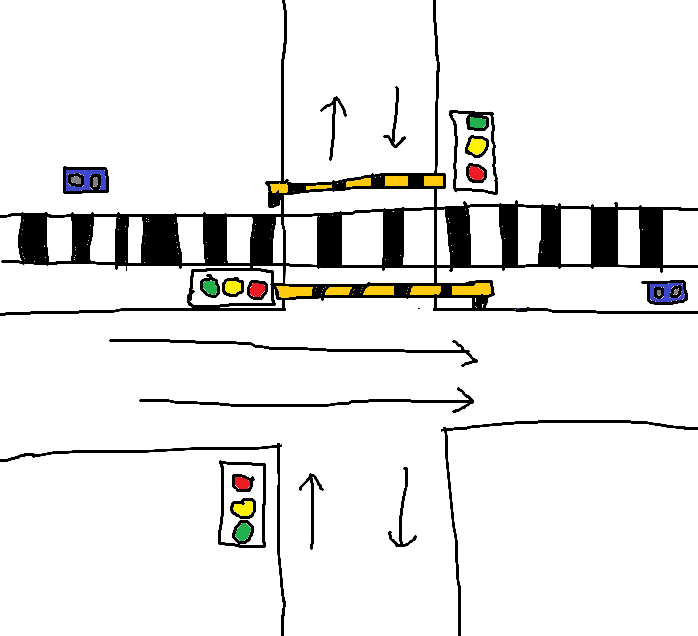

# smart-traffic-light-railway
Arduino-based traffic light system integrated with a railway barrier using ultrasonic sensors to prevent congestion during train crossings.


# 🚦 Smart Traffic Light with Railway Barrier (Arduino)

This project is a simple simulation of a traffic light system integrated with a railway crossing barrier using Arduino.


## Concept

The system is designed to prevent traffic congestion when a train is passing.

### When Train is Detected:
- Road crossing the railway → 🔴 RED light
- Road parallel to railway → 🟢 GREEN light
- Barrier → CLOSED
- Buzzer → ON

### Normal Condition:
- Traffic lights operate normally using delay timing
- Barrier → OPEN
- Buzzer → OFF

This system ensures vehicles do not stop on the railway crossing and avoids blocking other lanes.

---

## Components

- 1x Arduino Uno (or compatible)
- 2x Ultrasonic Sensor (HC-SR04)
- 2x Servo Motor (parallel, 1 signal pin)
- 1x Buzzer
- 3x Traffic Light Sets (2 connected in parallel)
- Resistors (as needed)
- Jumper wires
- Breadboard / PCB

---

## Pin Configuration (Simplified)

| Component        | Pin |
|-----------------|-----|
| Servo           | 5   |
| Ultrasonic 1    | Trig: 6, Echo: 8 |
| Ultrasonic 2    | Trig: 3, Echo: 4 |
| Buzzer          | 2   |
| Traffic Light 1 | 7, 9, 10 |
| Traffic Light 2 | 11, 12, 13 |

---

## System Illustration



---

## Notes

- This project was previously tested using a physical prototype.
- However, the prototype has been disassembled for other projects, so it has not been re-tested recently.
- Two servos are connected in parallel using a single signal pin.
- The system uses delay-based timing, so the response may not be real-time.

---

## Purpose

This project was created as a learning project and portfolio to demonstrate basic embedded system logic using Arduino.

---

## Additional Improvement (Optional)

The buzzer in this project currently uses a simple ON/OFF sound.

For a more realistic railway crossing alarm (e.g., "ninu ninu" sound), a passive buzzer can be used with the `tone()` function.

Example implementation:

```cpp
tone(buzzer, 1000);
delay(200);
tone(buzzer, 1500);
delay(200);
```

---

## 👨‍💻 Author

Made for learning and fun 🚀
